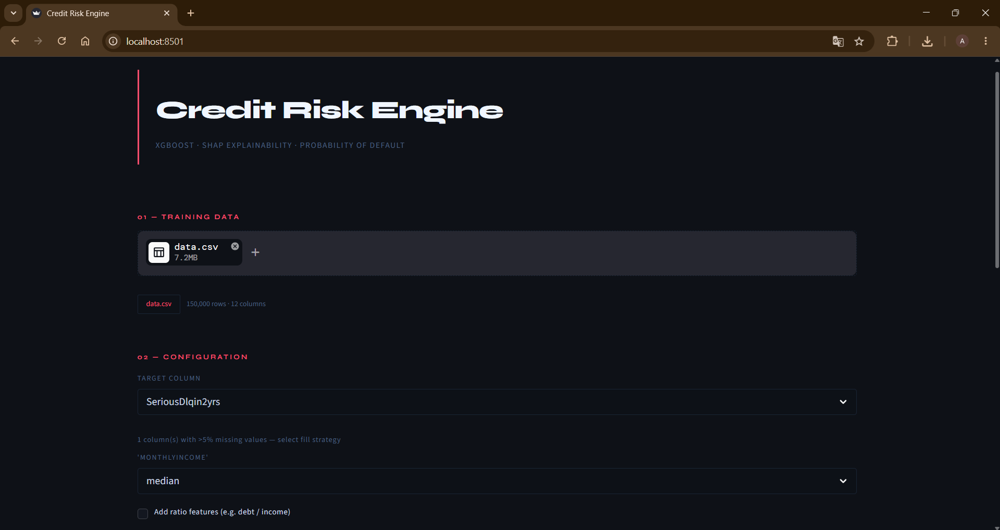
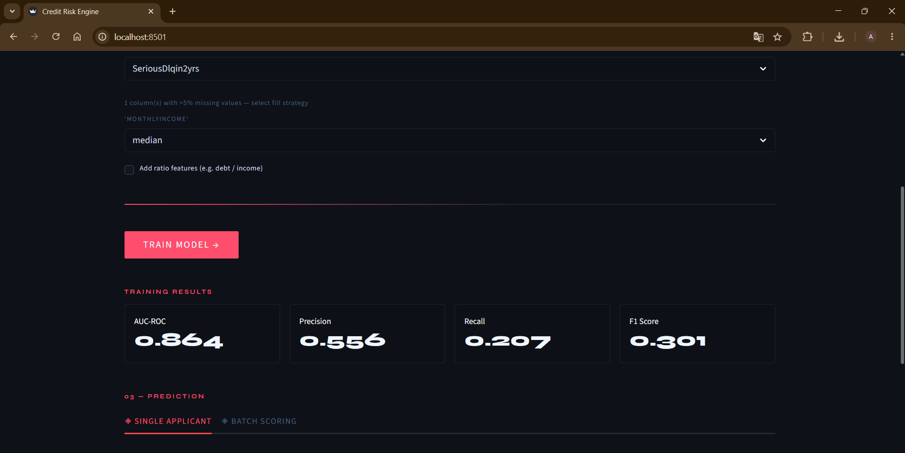
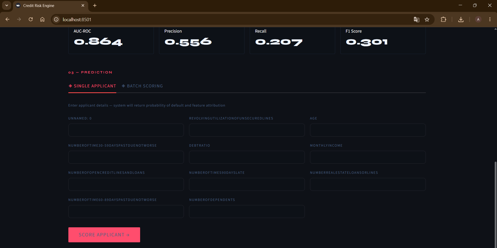
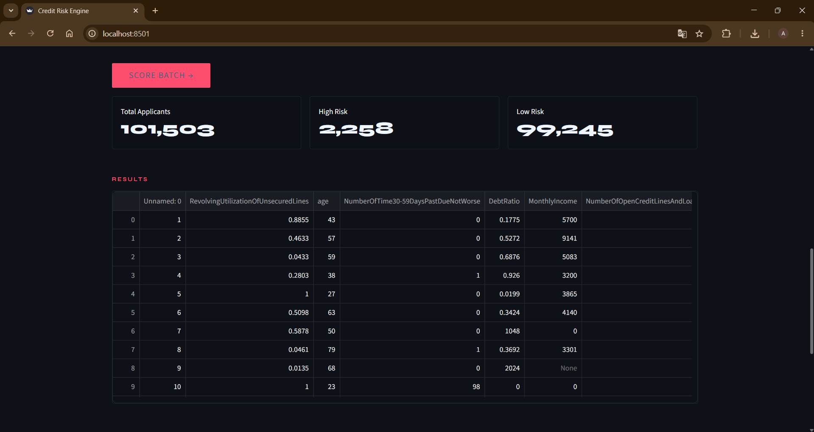
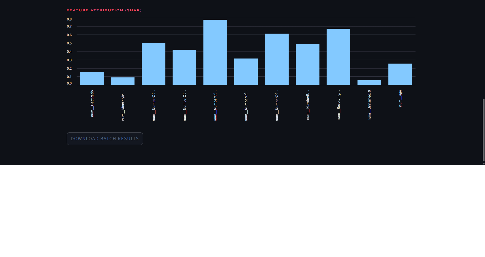

# Credit Risk



## Project Content
This project is an end-to-end machine learning application that predicts 
whether a credit applicant will default on their loan. As digital banking 
grows, the ability to assess credit risk automatically has become critical 
for financial institutions. This tool enables dynamic model training on 
custom datasets and real-time probability of default scoring.

## Features

- **Dynamic Training** — Users can upload their own dataset and train a new model without any code change
- **Automated Hyperparameter Optimization** — Optuna finds the best XGBoost parameters automatically using Bayesian optimization
- **SHAP Explainability** — Every prediction comes with feature attribution showing why the model made that decision
- **Imbalanced Data Handling** — SMOTE generates synthetic minority samples to prevent model bias toward majority class
- **Experiment Tracking** — MLflow logs every training run with parameters and metrics
- **Single & Batch Prediction** — Score a single applicant or thousands at once
- **Containerized** — Fully dockerized, runs anywhere with a single command

## How does it work?
- User uploads his old credit applications data as CSV or XLSX
- It can be determined that what strategy will be used while filling the columns that have more "None" values than %5 (Otherwise, they will be filled with "median" value)
- User also can select pairs of columns that will be used as a ratio in order to improve the model's prediction skill.
- There are two way to make a prediction, single prediction, which data for single customer is entered and the model predits; batch prediction, which user uploads a group of customer and the model predicts.
- In the end, results are shown as two different tables. One includes the probability not to be paid, the other includes which feature the model used most to make this prediction.

## Screenshots

### Accuracy Scores


### Single Prediction


### Prediction Results




## Tech Stack

- **Language:** Python 3.12
- **Api Framework:** FastAPI
- **Deployment:** Docker & Docker Compose
- **Model:** XGBoost Classifier
- **Pipeline:** Imbalanced Pipeline
- **Hyperparameter Optimization:** Optuna
- **Explainability:** SHAP
- **Experiment Tracking:** MLflow
- **Imbalanced Data:** SMOTE
- **UI:** Streamlit

## Getting Started
To run this project locally, ensure you have Docker installed

1. Clone the repository:
    ```bash
    git clone https://github.com/afdemir06/credit-risk.git
    cd credit-risk
    ```

2. Start the service using Docker Compose:
    ```bash
    docker-compose up --build
    ```

## Project Structure
```
credit-risk/
├── src/
│   ├── model/
│   │   ├── evaluation.py
│   │   ├── explainability.py
│   │   ├── prediction.py
│   │   └── training.py
│   ├── config.py
│   ├── data_cleaning.py
│   ├── feature_engineering.py
│   └── utils.py
├── tests/
│   ├── conftest.py
│   ├── test_data_cleaning.py
│   ├── test_evaluation.py
│   ├── test_feature_engineering.py
│   └── test_training.py
├── api.py
├── app.py
├── docker-compose.yml
├── Dockerfile.api
├── Dockerfile.app
├── Dockerfile.mlflow
├── requirements.txt
└── README.md
```